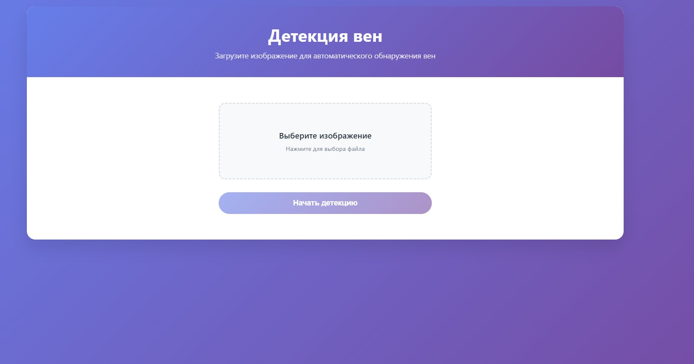
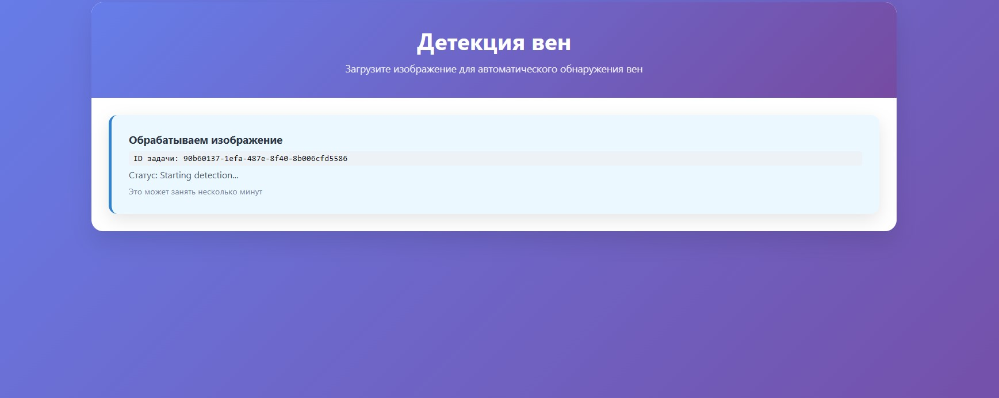
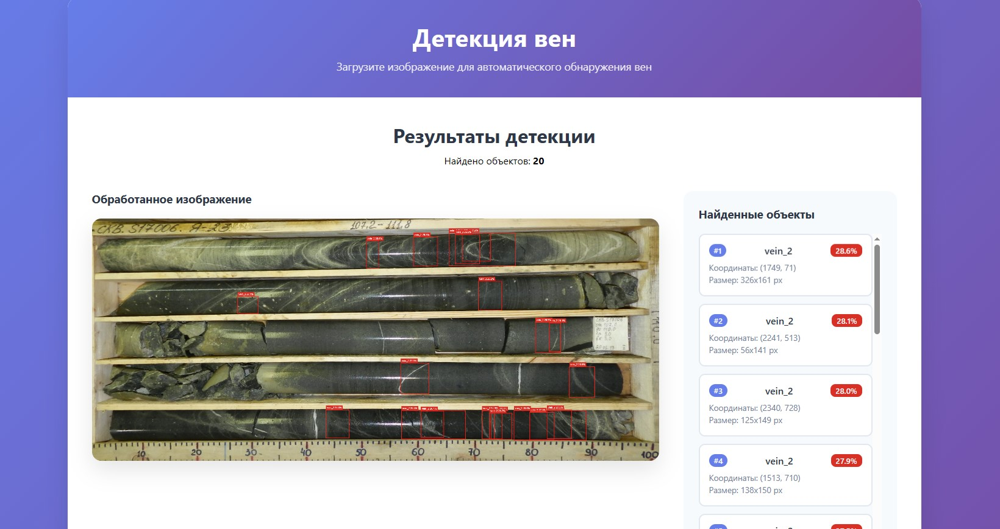

# Vein Detection App

Веб-приложение для загрузки изображений и автоматической детекции вен. Frontend отправляет изображение в API, backend ставит задачу в очередь Celery, worker выполняет инференс модели, сохраняет исходное и обработанное изображение в MinIO и возвращает найденные bounding boxes.

## Технологический стек

- Frontend: React, Axios, CSS.
- Backend API: FastAPI, Uvicorn.
- Очереди и фоновые задачи: Celery, Redis.
- Хранение данных: PostgreSQL, SQLAlchemy.
- Хранение изображений: MinIO с S3 API, boto3.

## Запуск через Docker Compose


Запуск:

```powershell
docker compose up --build
```

После старта:

- Frontend: `http://127.0.0.1:3000`


## Настройки

Основные параметры задаются в `docker-compose.yml`:

- `SCORE_THRESHOLD` - минимальная уверенность детекции.
- `MAX_DETECTIONS` - максимальное количество возвращаемых объектов.

## Как должно выглядеть пр







